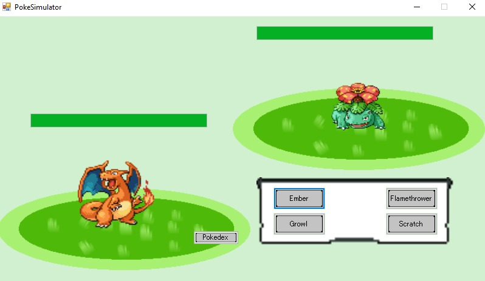
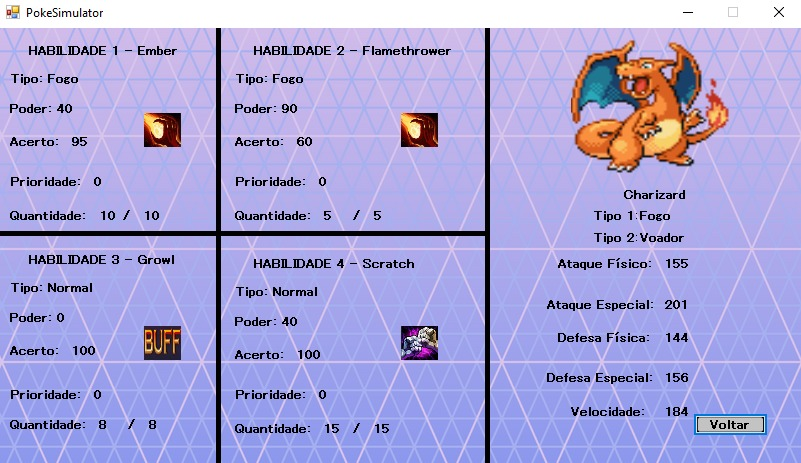
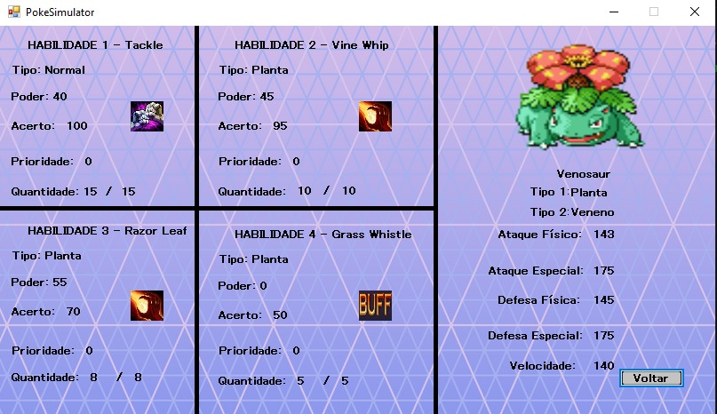
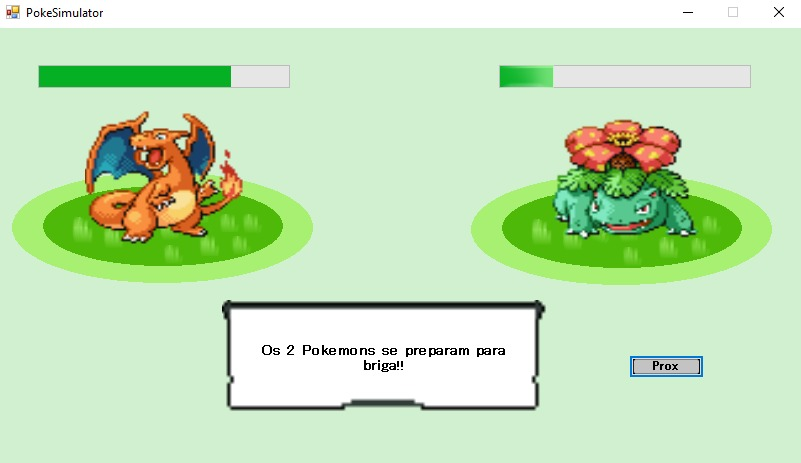
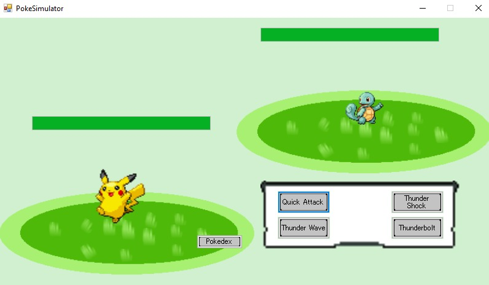

<h1 align="center">
    # simulador batalha pokemon
    
    
    
    
    
</h1>

## Sobre 📖
O projeto simula uma batalha pokemon no windowsforms do visual studio. Feito por mim e por meus amigos de escola, o projeto serviu para por em prática tudo o que aprendemos nesses três anos do ensino médio integrado com o curso técnico em desenvolvimento de sistemas no Colégio Pedro II, que todos nós cursávamos.

## Como funciona ⛏
Você escolhe os pokemons, seus leveis e suas habilidades, após isso se inicia a batalha. Dependendo do tipo da habilidade que você escolher, coisas diferentes acontecerão. Os cálculos de dano usam as mesmas fórmulas que os jogos originais. 

## Considerações finais ✨
A princípio a ideia do projeto era recriar todo o jogo, porém fomos achando
